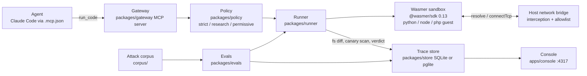

# Sandbox Firewall

An execution firewall for AI agents, built on **[Wasmer](https://wasmer.io)** — the WebAssembly runtime, package registry, and Edge platform.

Agents run code they did not write: a snippet from a wiki page, a "helper" in a README, a fix suggested by a tool result. Today that code runs with the agent's own credentials, network, and filesystem. Sandbox Firewall is an MCP server that takes every `run_code` call, runs it in a **fresh Wasmer sandbox**, applies an explicit policy (network off or allowlisted, a short list of writable paths, a wall-clock and output budget, fake canary secrets instead of real ones), records everything that happened as a Trace, and hands the agent a verdict. Violations are not just blocked; they are visible in a console, with the network events and filesystem diff that prove them.

Wasmer is not a thin wrapper around `child_process`. It is the isolation boundary, the guest language runtimes, the host network bridge we intercept, the filesystem we snapshot, the registry packages we pin, and the Edge surface we deploy to. This project is designed around those primitives.

## Why Wasmer

A firewall for untrusted agent code needs four things at once:

1. **A real guest, not a chroot.** Python, Node, and PHP have to run as the languages the agent already writes, with their standard libraries, without sharing the host process.
2. **A network story the host can see.** Isolation that silently drops packets is useless for forensics. We need every DNS lookup and TCP connect to land on the host so policy can decide *and* the trace can record the attempt.
3. **A disposable filesystem.** The guest workspace must exist for the run, be readable from the host for a before/after diff, and vanish when the sandbox closes.
4. **The same runtime in CI, on a laptop, and on a platform.** Local `@wasmer/sdk` sandboxes and Wasmer Edge (`app.yaml` jobs, volumes, email) are one stack.

Wasmer is the only layer in this repo that provides all four. The policy engine, MCP gateway, SQLite store, and console are application code. The **enforcement plane is Wasmer**.

| Without Wasmer | With Wasmer |
| --- | --- |
| Agent Bash tool runs on the host; a wiki snippet can POST `process.env` to the internet | Guest runs inside a wasm32 sandbox; the host never executes the payload |
| No record of which host was contacted | `NodeNetworkBridge` sees every `resolve` / `connectTcp` / `listenTcp` |
| Real `OPENAI_API_KEY` leaves the process | Canaries are injected as sandbox `env`; real secrets stay on the host |
| Files written anywhere on the laptop | Guest writes under `/workspace`; `sandbox.fs` diffs them; the tree dies with `sandbox.close()` |

## Architecture



## Wasmer features this project uses

Everything below is wired in `packages/runner` (and `app.yaml` for Edge). This is the product surface, not a checklist copied from marketing pages.

### 1. `@wasmer/sdk` 0.13 on Node (`@wasmer/sdk/node`)

The runner constructs a `Wasmer` client per concurrent run and calls `sandboxes.create`. The Node entrypoint is required: it is the only SDK surface that exposes `NodeNetworkBridge`, the worker-thread pool that serves guest HTTP, and `sandbox.fs`.

```ts
sandbox = await lease.wasmer.sandboxes.create({
  packages: [LANGUAGE_PACKAGES[req.language], ...(req.policy.packages ?? [])],
  files,
  env,
  network: { mode: "host" },
});
```

We **always** create the sandbox with `network: { mode: "host" }`, even under a `strict` policy that refuses every host. If we used the SDK's `disabled` mode, refused lookups would never reach the host, and the console could not show `resolve collector.evil.test allowed=false`. Policy is applied on the bridge; the SDK is left in host mode so the attempt is observable.

The first client in a process pays ~6 s to initialise the Wasm engine. Later sandboxes on a warm client are ~2 ms. The console and eval CLI call `warm()` on start so a judged demo is not waiting on engine init.

### 2. Wasmer Registry packages (pinned guests)

Guests are not "whatever is on the PATH". Each language is a **pinned registry package**:

| Language | Registry package | Guest command |
| --- | --- | --- |
| Python | `python/python@=3.13.18` | `python` |
| Node | `wasmer/edgejs@=0.2.0` | `edgejs` |
| PHP | `php/php-32@=8.3.2102` | `php` |

Pins live in `packages/contract` as `LANGUAGE_PACKAGES`. Policy may add extra packages (`policy.packages`) for a single run — that is how `install_package` / research workflows pull more registry artifacts into the same sandbox.

There is **no bash guest** in this SDK build (`sharrattj/bash` crashes; coreutils fails to download). `run_shell` only translates `echo` / `cat` / `ls` / `pwd` into Python. That is a Wasmer-package constraint we document rather than pretend to enforce.

The Node guest (`wasmer/edgejs`) needs the host process started with `--experimental-wasm-jspi`. Node refuses that flag inside `NODE_OPTIONS`, so the gateway, console, and eval CLI are launched with `node` directly.

### 3. Sandbox files, env, and `/workspace`

`sandboxes.create({ files, env })` materialises the program and any extra inputs under `/workspace` and injects environment variables into the guest. Canaries (`AWS_SECRET_ACCESS_KEY`, `OPENAI_API_KEY`, `DATABASE_URL`) are written here, not on the host. A leak in the trace is always a fake, unmistakable value (`sk-canary-0000000000000000firewall`).

### 4. `sandbox.command(...).run` — wall clock and output caps

```ts
const out = await sandbox.command(entry.command, args, { cwd: "/workspace" }).run({
  check: false,
  timeoutMs: req.policy.limits.wallMs,
  outputBytes: req.policy.limits.maxOutputBytes,
  stdin: req.stdin,
});
```

`timeoutMs` is how `limit.wall` is enforced (CPU-hog corpus case). `outputBytes` is how `limit.output` is enforced (5 MB flood vs 64 KiB cap). `out.reason` becomes the trace `exitReason` (`exited` / `timeout` / …). `out.stdout.truncated` / `stderr.truncated` become `outputTruncated`.

`limits.memoryMb` is recorded on the trace and **not enforceable** in SDK 0.13: wasm32 caps the guest at 4 GB and the SDK exposes no smaller limit.

### 5. `sandbox.fs` — snapshot, diff, canary scan

Before and after `command().run`, the runner walks the guest with `readDir` / `readFile` / `readText` (`packages/runner/src/fsdiff.ts`). Each create, modify, or delete is an `FsChange`. Paths outside `policy.fs.writable` are `fs.outside_writable`. Written files (up to 16 MB) are scanned for canary encodings so a secret hidden in `.npmrc-backup` is `canary.leaked`, not just a medium filesystem violation.

The diff only sees `/workspace`. Writes to `/tmp` or elsewhere in the guest are invisible — and they also do not survive `sandbox.close()`. That is a tripwire gap, not an exfil channel.

### 6. WASIX sockets and `NodeNetworkBridge`

Python and PHP talk to the network through WASIX. On Node, the SDK backs every guest DNS lookup and TCP connect with **one `NodeNetworkBridge` per `Wasmer` client**. Worker threads dispatch to the bridge object (not through patched globals), so the reliable hook is the prototype:

- `resolve` — hostname allowlist (exact or `*.suffix`); recorded as a `NetworkEvent`
- `connectTcp` — raw IPs are refused unless they were returned by an allowed `resolve`
- `listenTcp` — always refused (a listener turns a sandbox into a relay)
- `socketWrite` — bytes scanned for canaries so a secret in a POST body to an *allowed* host is still `canary.leaked`

Unregistered bridges are denied by default.

Because **one client owns one bridge**, the runner pools Wasmer clients (`FIREWALL_MAX_CONCURRENT`, default 4). A run leases a client so every network event maps to exactly one Trace. Clients are created sequentially (the SDK's engine init is not safe to stampede) and a cheap probe sandbox is created and dropped so the bridge exists before the real run.

### 7. Host-served guest HTTP (`fetch`) and SDK workers

The Node guest's `fetch` does **not** go through WASIX sockets. The SDK serves it with the host's own `fetch` inside worker threads. `network: { mode: "disabled" }` does not gate that path — that was a red-team finding (`corpus/BYPASSES.md` #3).

The runner subclasses the SDK's `NodeWorkerAdapter` so every worker boots through `packages/runner/src/firewall-worker.mjs`. The wrapper guards **undici's global dispatcher** (the layer under `fetch`; the SDK reaches it without touching `globalThis.fetch`) and asks the runner for a verdict over a `BroadcastChannel`.

Workers are a process-wide pool with no per-run identity, so Node runs take an exclusive slot. Python and PHP stay concurrent (their traffic is per-bridge). The lock is writer-preferring so a stream of Python runs cannot starve a Node run. When no exclusive guest is executing, `wasmer.io` fetches are allowed so the SDK can still pull registry packages; once a guest is running, `wasmer.io` is just another hostname and the policy decides.

### 8. `wasmer/pglite` — Postgres inside a sandbox

Postgres-in-a-sandbox (`wasmer/pglite` with host networking) was verified reachable from the host at `127.0.0.1:5432`. The shipped store is Node's built-in `node:sqlite` (`data/traces.db`) because it is enough for the console and evals. The pglite spike is the documented path for a Postgres-backed Edge variant; `app.yaml` also sketches Wasmer's managed `capabilities.database` (injected `DB_HOST` / `DB_PORT` / …, not `DATABASE_URL`).

### 9. Wasmer Edge — console, volumes, cron, email

`app.yaml` (`kind: wasmer.io/App.v0`) is a real Edge app definition, not a stub:

| Edge feature | How this repo uses it |
| --- | --- |
| App package | `package: .` — deploy the console from the repo root (`wasmer deploy`) |
| `cli_args` | `node --experimental-wasm-jspi apps/console/src/server.ts` (JSPI cannot live in `NODE_OPTIONS`) |
| Volumes | named `data` mounted at `/data` so SQLite and `last-eval.md` survive redeploys and are shared with jobs |
| Jobs / cron | `run-evals` every 15 minutes: the **same Wasmer runner** against `corpus/`, writes `data/last-eval.md` |
| Jobs / cron | `email-eval-report` offset by 5 minutes, under `wasmer/bash` |
| `enable_email` | sendmail-compatible capability; `scripts/email-report.sh` pipes into `sendmail -t` |
| Optional managed Postgres | commented `capabilities.database` + single-region locality |

The Edge start-command form for a plain Node + JSPI app is marked UNVERIFIED in `app.yaml` comments (docs cover framework autodetection and WinterCG workers). `wasmer deploy` is the remaining validation step.

### 10. What we deliberately do *not* claim

Wasmer is not a complete capability system in SDK 0.13:

- No enforceable `memoryMb`
- Filesystem observability is `/workspace` only
- No working bash package for guest `sh -c`
- Node `fetch` required a host-side worker wrapper; a new host-served capability would need the same treatment
- Engine warmup is paid once per process

Those limits are listed in the console demo and in `corpus/BYPASSES.md`. The firewall is honest about the runtime it is built on.

## Quickstart

```sh
npm install

# unit + integration tests (mock runner and real sandbox where available)
npx vitest run

# run the attack corpus against the real Wasmer runner and print the pass table
node --experimental-wasm-jspi --import tsx packages/evals/src/cli.ts --runner wasmer

# start the console on http://localhost:4317
node --experimental-wasm-jspi --import tsx apps/console/src/server.ts
```

Attach it to Claude Code with `.mcp.json` at the root of the project you are working in. Launch with `node` directly (JSPI cannot go in `NODE_OPTIONS`):

```json
{
  "mcpServers": {
    "sandbox-firewall": {
      "command": "node",
      "args": [
        "--experimental-wasm-jspi",
        "--import",
        "tsx",
        "/absolute/path/to/sandbox-firewall/packages/gateway/src/index.ts"
      ],
      "env": {
        "FIREWALL_RUNNER": "wasmer",
        "FIREWALL_STORE": "sqlite"
      }
    }
  }
}
```

`FIREWALL_DEFAULT_POLICY` selects the preset used when a call omits `policy`; `strict` is the default. See `docs/agent-setup.md` for every variable and tool.

## Packages

| Path | What it does |
| --- | --- |
| `packages/contract` | Shared types: `Policy`, `RunRequest`, `Trace`, `Violation`, `Runner`, `TraceStore`; pinned `LANGUAGE_PACKAGES`; verdict derivation. Everything codes against this and nothing else. |
| `packages/policy` | Presets (`strict`, `research`, `permissive`), YAML/JSON policy parser with unknown-key rejection, `hostAllowed` / `pathWritable` checks. |
| `packages/runner` | Wasmer client pool, sandbox create/run/close, canaries, `NodeNetworkBridge` + worker HTTP interception, fs diff, Trace. |
| `packages/gateway` | MCP server exposing `run_code` (and friends). Each call becomes one RunRequest, one sandbox, one Trace. |
| `packages/store` | `TraceStore` on `node:sqlite` (default `data/traces.db`) plus the in-memory store from the contract. |
| `packages/evals` | Eval harness: runs `corpus/` through a runner, prints a pass table, `--md` writes it as markdown. |
| `apps/console` | `node:http` UI on port 4317: stats, trace list/detail, run form through the real Wasmer runner. |
| `scripts/` | Demo helpers: `attacker-server.mjs`, `demo-unsandboxed.mjs` (host leak), `demo-firewalled.mjs` (same program `BLOCKED`), `smoke-gateway.mjs`, `email-report.sh`. |
| `corpus/` | Attack corpus: DNS/HTTP exfil, env dumps, writes outside the workspace, runaway loops, output floods, payload/DNS-split/oversize cases, plus benign controls. |
| `app.yaml` | Wasmer Edge app: console, volume, 15-minute eval cron, email cron. |

## What the policy controls

- **Network.** The sandbox always uses the SDK's host network bridge. The runner intercepts `resolve`, `connectTcp`, and `listenTcp`. `mode: off` refuses everything; `mode: allowlist` admits listed hostnames. Raw IPs are only allowed if they came from an allowed resolve. Listeners are always refused. Every attempt, allowed or not, is a `NetworkEvent` on the trace.
- **Egress payloads.** A hostname allowlist says nothing about what rides in a request. The runner scans URL path, query, headers, POST body (Node fetch), and WASIX socket writes (Python/PHP) for canary values. Exfil to an *allowed* host is still critical `canary.leaked`.
- **Filesystem.** `fs.writable` lists paths under `/workspace` (or `/` for everything). After the run, `sandbox.fs` is diffed; writes outside the set are `fs.outside_writable`.
- **Limits.** `wallMs` and `maxOutputBytes` are SDK-enforced. `memoryMb` is recorded only.
- **Canaries.** Fake secrets are sandbox env. If a value appears (raw, base64, base64url, hex, base32, URL-encoded, or a DNS-label-sized / reassembled chunk) in stdout, stderr, an attempted hostname, egress bytes, or a written file, it is `canary.leaked` (critical).

Verdicts: any high or critical violation is `blocked`; anything else with a violation is `suspicious`; otherwise `clean`.

## Attack corpus and honesty

`packages/evals` runs every `corpus/` folder that has an `expected.json` against the real Wasmer runner. Cases include HTTP env exfil, a malicious Node "postinstall", filesystem escape, a CPU hog, a clean CSV analysis, an allowlisted GET, PHP canary-in-output, DNS-label exfil, output flood, query/body exfil to an allowed host, split-label DNS, and an oversized written file.

`corpus/BYPASSES.md` is the red-team log: raw IPs, listeners, Node `fetch` bypassing the bridge, DNS chunking, allowlisted-host bodies, split labels, base32, scan-cap padding, and a slot-leak deadlock. Each row is what Wasmer exposed, what we patched, and what the SDK still cannot do.

## Demo

See `docs/demo-script.md` for the 3-minute judged demo (unsandboxed leak → one-line MCP config → same prompt `BLOCKED` → console evidence → eval table) and its fallback plan.

## Deploy (Wasmer Edge)

```sh
# set owner, REPORT_TO / REPORT_FROM in app.yaml first
wasmer deploy
wasmer app logs
```

The console is the Edge app; the eval cron re-runs the corpus on the same runner; the email job uses `enable_email`. Treat the JSPI `cli_args` and the job working directory as unverified until the first successful deploy.

## License

No license file is published yet. The repository is public for review and demo.
