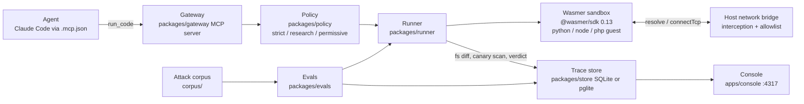

# Sandbox Firewall

An execution firewall for AI agents, built on the Wasmer SDK.

Agents run code they did not write: a snippet from a wiki page, a "helper"
in a README, a fix suggested by a tool result. Today that code runs with the
agent's own credentials, network and filesystem. Sandbox Firewall is an MCP
server that takes every `run_code` call, runs it in a fresh Wasmer sandbox
under an explicit policy (network off or allowlisted, a short list of
writable paths, a wall-clock and output budget, fake canary secrets instead
of real ones), records everything that happened as a Trace, and hands the
agent a verdict. Violations are not just blocked; they are visible, in a
console, with the network events and filesystem diff that prove them.

## Architecture



## Quickstart

```sh
npm install

# unit + integration tests (mock runner and real sandbox where available)
npx vitest run

# run the attack corpus against the real Wasmer runner and print the pass table
node --experimental-wasm-jspi --import tsx packages/evals/src/cli.ts --runner wasmer

# start the console on http://localhost:4317
node --experimental-wasm-jspi --import tsx apps/console/src/server.ts
```

Attach it to Claude Code by adding the gateway to `.mcp.json` at the root
of the project you are working in. The server is launched with `node` directly because the Node guest inside
the sandbox needs the JSPI flag on the host, and Node refuses that flag in `NODE_OPTIONS`.

```json
{
  "mcpServers": {
    "sandbox-firewall": {
      "command": "node",
      "args": ["--experimental-wasm-jspi", "--import", "tsx", "C:/AI/Projects/wasmer/packages/gateway/src/index.ts"],
      "env": { "FIREWALL_RUNNER": "wasmer", "FIREWALL_STORE": "sqlite" }
    }
  }
}
```

`FIREWALL_DEFAULT_POLICY` selects the preset used when a call omits `policy`;
`strict` is the default. See `docs/agent-setup.md` for every variable and tool.

## Packages

| Path | What it does |
| --- | --- |
| `packages/contract` | Shared types: `Policy`, `RunRequest`, `Trace`, `Violation`, `Runner`, `TraceStore`; verdict derivation. Everything codes against this and nothing else. |
| `packages/policy` | Presets (`strict`, `research`, `permissive`), YAML/JSON policy parser with unknown-key rejection, `hostAllowed` / `pathWritable` checks. |
| `packages/runner` | Creates the Wasmer sandbox, injects canaries, intercepts the network bridge, runs the code with limits, diffs the filesystem, scans output for canaries, builds the Trace. |
| `packages/gateway` | MCP server exposing `run_code` (and friends). Each call becomes one RunRequest, one sandbox, one Trace; the tool result carries the verdict and violation list. |
| `packages/store` | `TraceStore` on Node's built-in `node:sqlite` (default `data/traces.db`) plus the in-memory store from the contract. |
| `packages/evals` | Eval harness: runs `corpus/` through a runner, prints a pass table, `--md` writes it as markdown. |
| `apps/console` | `node:http` UI on port 4317: stat tiles, trace list, trace detail with network events, fs diff, violations and timings, and a run form that executes through the real runner. |
| `scripts/` | Demo helpers: `attacker-server.mjs` (collector), `demo-unsandboxed.mjs` (host run leaks the canary), `demo-firewalled.mjs` (same program through the gateway, BLOCKED), `smoke-gateway.mjs`. |
| `corpus/` | The attack corpus: exfil over DNS/HTTP, env dumps, writes outside the workspace, runaway loops, output floods, plus benign controls. |

## What the policy controls

- **Network**: the sandbox always uses the SDK's host network bridge, and the
  runner intercepts every `resolve`, `connectTcp` and `listenTcp` on the host
  side. `mode: off` refuses everything; `mode: allowlist` admits hostnames on
  the list (exact or `*.suffix`), and a raw IP connect is only allowed if it
  came from an allowed resolve. Listeners are always refused. Every attempt,
  allowed or not, is a `NetworkEvent` on the trace, which is how a strict
  policy still tells you which host the code tried to reach.
- **Filesystem**: `fs.writable` lists paths under `/workspace` (or `/` for
  everything). After the run the runner diffs the sandbox filesystem;
  each create/modify/delete is an `FsChange`, and any outside the writable
  set is an `fs.outside_writable` violation.
- **Limits**: `wallMs` is enforced by the SDK run timeout, `maxOutputBytes`
  by the SDK output cap; hitting either is a `limit.wall` / `limit.output`
  violation. `memoryMb` is recorded only (see Limits below).
- **Canaries**: the policy injects fake secrets as env vars
  (`AWS_SECRET_ACCESS_KEY`, `OPENAI_API_KEY`, `DATABASE_URL`, with
  unmistakable values). If a canary value (raw, base64, base64url, hex,
  URL-encoded, or a DNS-label-sized chunk of it) appears in stdout, stderr,
  an attempted hostname or a file the run wrote, it is a `canary.leaked`
  violation, severity critical.

Verdicts: any high or critical violation is `blocked`; anything else with a
violation is `suspicious`; otherwise `clean`.

## Limits

Being honest about what is and is not enforced:

- `memoryMb` is recorded on the trace but **not enforceable** in
  `@wasmer/sdk` 0.13. wasm32 caps the guest at 4 GB and the SDK exposes no
  smaller limit.
- The filesystem diff only sees `/workspace`. Writes to `/tmp` or elsewhere
  in the guest are not diffed (they also do not survive the sandbox).
- **No shell**: no bash package works in this SDK build, so guests cannot run
  `sh -c`. Code is executed directly by the language runtime. That also
  means shell-based attacks in the corpus are moot rather than blocked.
- The Node guest (`wasmer/edgejs`) needs the host started with
  `--experimental-wasm-jspi`. Without it the sandbox fails to run.
- The Node guest's `fetch` is served by the host's own `fetch` inside the
  SDK's worker threads, not by WASIX sockets, and the SDK's
  `network: { mode: "disabled" }` does not gate it. The runner replaces the
  SDK worker entry with `packages/runner/src/firewall-worker.mjs`, which
  wraps `fetch` and asks the runner for a verdict. Because the worker pool
  has no per-run identity, Node runs execute one at a time so every verdict
  lands on exactly one trace. See `corpus/BYPASSES.md`.
- The first sandbox in a process takes about 6 s to initialise the engine;
  subsequent sandboxes take about 2 ms. The console and eval CLI warm the
  engine on start.

## Wasmer features used

- `sandboxes.create` with `packages` (pinned registry packages per
  language), `files` (the program and any extra inputs under `/workspace`),
  `env` (canaries plus policy env) and `network` (`off` or `host` mode).
- `command(...).run` with `timeoutMs` and `outputBytes` for the wall-clock
  and output limits.
- `sandbox.fs` (`readDir`, `readFile`, `readText`) before and after the run
  to compute a content-hashed filesystem diff and scan written files.
- Worker-side `fetch` interception through a custom `setWorkerUrl` entry so
  host-served guest HTTP answers to the same policy.
- Host network bridge interception: wrapping `NodeNetworkBridge.resolve`,
  `connectTcp` and `listenTcp` so the policy decides every DNS lookup and
  TCP connect, and every decision becomes a trace event. One Wasmer client
  per concurrent run, pooled, so each bridge maps to exactly one trace.
- Postgres in a sandbox (`wasmer/pglite` with host networking) was verified
  reachable from the host at 127.0.0.1:5432; the store ships on SQLite and
  the pglite spike is documented for the Edge variant.
- Wasmer Edge: `app.yaml` deploys the console, a cron job re-runs the eval
  corpus every 15 minutes, and a second cron job emails the result through
  the sendmail-compatible `enable_email` capability
  (`scripts/email-report.sh`).

## Demo

See `docs/demo-script.md` for the 3-minute judged demo and its fallback plan.
